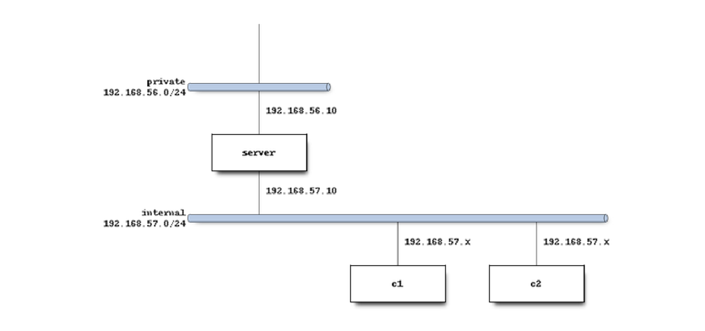

# 2 ASIR - DHCP - Practice A (Client/Server) Ansible integration

## Used Technologies

&nbsp;
&nbsp;
&nbsp;
&nbsp;
&nbsp;
&nbsp;
&nbsp;
&nbsp;

## Authors of the project

- **Juan Amador Hinojosa Gálvez** – [jhingal3010@ieszaidinvergeles.org](mailto:jhingal3010@ieszaidinvergeles.org)
- **Álvaro Rodríguez Pulido** – [arodpul3005@ieszaidinvergeles.org](mailto:arodpul3005@ieszaidinvergeles.org)

## Practice Objective

Set up a virtualized environment with three virtual machines, using Vagrant in a Linux environment. The virtual machines must comply with the next requirements:

- **DHCP Server (sv)** that assigns network configurations automatically.
- **Client 1 (c1)** that receives its network configuration via DHCP.
- **Client 2 (c2)** that gets a fixed IP address based on its MAC address.

## Prerequisites

- [Vagrant](https://www.vagrantup.com/)
- Recommended base box: `ubuntu/jammy64`
- [VirtualBox](https://www.virtualbox.org/)
- [Ansible](https://www.ansible.com/)
- [Python](https://www.python.org/)

## Network Diagram



## Network Structure

- External (host-only) network: `192.168.56.0/24`
  - **Server**: static IP `192.168.56.10`
- Internal network: `192.168.57.0/24`
  - **Server**: static IP `192.168.57.10`
  - **c1:** DHCP IP.
  - **c2:** DHCP IP based on MAC address.


## DHCP Server Configuration

- Network: `192.168.57.0/24`
- Dynamic range: `192.168.57.25 - 192.168.57.50`
- Broadcast address: `192.168.57.255`
- Gateway: `192.168.57.10`
- DNS Servers: `8.8.8.8` and `4.4.4.4`
- Domain name: `micasa.es`
- Default lease time: `1 day`
- Maximum lease time: `8 days`
  
**MAC address configuration (for Client 2):**
- MAC: `08:00:27:c2:c2:c2`
- Fixed address: `192.168.57.4`
- Default lease time: `1 hour`

## Client Configuration
- Network mode: `Internal Network`
- DHCP: `Enabled`
- Obtain dynamically new IP address command:
```bash
sudo dhclient
```
- Logs: `/var/log/syslog`
- Leases file: `/var/lib/dhcp/dhcp.leases`

## Files found in this repository
- **Vagrantfile:** Defines the virtual machines that will be created, with their network configuration:
```ruby
# -*- mode: ruby -*-
# vi: set ft=ruby :

Vagrant.configure("2") do |config|
  config.vm.box = "ubuntu/jammy64"

  # 2GB of RAM to avoid issues at startup
  config.vm.provider "virtualbox" do |vb|
    vb.memory = 2048
  end

  # DHCP SERVER (sv)
  config.vm.define "dhcp-sv" do |dhcpsv|
    dhcpsv.vm.hostname = "dhcp-sv.izv.dhcp-sv-cli"

    # Host-only network (192.168.56.0/24) with Internet
    dhcpsv.vm.network "private_network", 
                      ip: "192.168.56.10"

    # Internal network (192.168.57.0/24), isolated for DHCP
    dhcpsv.vm.network   "private_network",
                      ip: "192.168.57.10",
                      virtualbox__intnet: "dhcp-sv-cli_net"

    dhcpsv.vm.provision "shell", path: "provision-dhcpsv.sh"
  end #dhcpsv

  # DHCP CLIENT 1 (c1)
  config.vm.define "dhcp-c1" do |dhcpc1|
    dhcpc1.vm.hostname = "dhcp-c1.izv.dhcp-sv-cli"

    # Internal network (192.168.57.0/24), isolated for DHCP
    dhcpc1.vm.network "private_network",
                      type: "dhcp",
                      virtualbox__intnet: "dhcp-sv-cli_net"
    
    dhcpc1.vm.provision "shell", path: "provision-dhcpc.sh"
  end #dhcpc1
  
  # DHCP CLIENT 2 (c2)
  config.vm.define "dhcp-c2" do |dhcpc2|
    dhcpc2.vm.hostname = "dhcp-c2.izv.dhcp-sv-cli"

    # Internal network (192.168.57.0/24), isolated for DHCP
    dhcpc2.vm.network "private_network",
                  type: "dhcp",
                  virtualbox__intnet: "dhcp-sv-cli_net",
                  mac: "080027c2c2c2"

    dhcpc2.vm.provision "shell", path: "provision-dhcpc.sh"
  end

end #Vagrant.configure
```
- **.gitignore:** It contains the files that will be ignored by the version control system.
- **LICENSE:** Defines the license of our project, to determine how can be used.
- **inventory.yml:** It defines the components of the project, their IP, port and private key.
```bash
all:
  vars:
    ansible_python_interpreter: /usr/bin/python3
    ansible_user: vagrant

  children:
    dhcp_servers:
      hosts:
        dhcp-sv:
          ansible_host: 192.168.56.10
          ansible_ssh_private_key_file: .vagrant/machines/dhcp-sv/virtualbox/private_key

    dhcp_clients:
      # On the clients, the port must be changed if there is
      # any service running on the ports :2222 / :2200 / :2201
      hosts:
        dhcp-c1:
          ansible_host: 127.0.0.1
          ansible_port: 2200
          ansible_ssh_private_key_file: .vagrant/machines/dhcp-c1/virtualbox/private_key

        dhcp-c2:
          ansible_host: 127.0.0.1
          ansible_port: 2201
          ansible_ssh_private_key_file: .vagrant/machines/dhcp-c2/virtualbox/private_key

```
- **playbook.yml:** It contains the commands and instructions that are given to the virtual machines when initializing.
```bash
---
- name: Configure DHCP server
  hosts: dhcp-sv
  become: true

  tasks:
    - name: Update package cache and upgrade
      ansible.builtin.apt:
        update_cache: true
        upgrade: dist

    - name: Install isc-dhcp-server
      ansible.builtin.apt:
        name: isc-dhcp-server
        state: present

    - name: Get interface with IP 192.168.57.X
      ansible.builtin.shell: |
        set -o pipefail
        ip -o -4 addr show | grep 192.168.57 | awk '{print $2}'
      args:
        executable: /bin/bash
      register: dhcp_iface
      changed_when: false

    - name: Configure INTERFACESv4 with the correct interface
      ansible.builtin.lineinfile:
        path: /etc/default/isc-dhcp-server
        regexp: '^INTERFACESv4='
        line: 'INTERFACESv4="{{ dhcp_iface.stdout }}"'

    - name: Backup dhcpd.conf (if it does not exist)
      ansible.builtin.copy:
        src: /etc/dhcp/dhcpd.conf
        dest: /etc/dhcp/dhcpd.conf.bak
        remote_src: true
        force: false
        mode: '0644'

    - name: Copy custom dhcpd.conf file from local machine to servers
      ansible.builtin.copy:
        src: files/sv-dhcpd.conf
        dest: /etc/dhcp/dhcpd.conf
        owner: root
        group: root
        mode: '0644'

    - name: Restart and enable isc-dhcp-server
      ansible.builtin.systemd:
        name: isc-dhcp-server
        state: restarted
        enabled: true

    - name: Show status of isc-dhcp-server service
      ansible.builtin.command:
        cmd: systemctl status isc-dhcp-server --no-pager
      register: status
      changed_when: false

    - name: Display isc-dhcp-server status
      ansible.builtin.debug:
        var: status.stdout


- name: Configure DHCP client (c1)
  hosts: dhcp_clients
  become: true

  tasks:
    - name: Update package cache and upgrade
      ansible.builtin.apt:
        update_cache: true
        upgrade: dist

    - name: Ensure netplan is installed
      ansible.builtin.apt:
        name: netplan.io
        state: present

    - name: Ensure isc-dhcp-client is installed
      ansible.builtin.apt:
        name: isc-dhcp-client
        state: present

    - name: Get the first active non loopback interface with an IPv4 address
      ansible.builtin.shell: |
        set -o pipefail
        ip -o -4 addr show scope global | awk '{print $2}' | head -n1
      args:
        executable: /bin/bash
      register: iface
      changed_when: false

    - name: Configure netplan to use DHCP on the interface
      ansible.builtin.template:
        src: c-netplan.j2
        dest: /etc/netplan/01-netcfg.yaml
        owner: root
        group: root
        mode: '0644'

    - name: Apply netplan configuration
      ansible.builtin.command: netplan apply
      changed_when: false

    - name: Force DHCP request
      ansible.builtin.command: dhclient -v "{{ iface.stdout }}"
      changed_when: false

    - name: Show current IP configuration
      ansible.builtin.command: ip a
      register: ip_config
      changed_when: false

    - name: Display current IP configuration
      ansible.builtin.debug:
        var: ip_config.stdout

```
- **ansible.cfg:** It blocks the ansible deprecation error messages from Vagrant.
- This variation of the project changes the old provision files for the .yml new ones, you can still find the provision in "old" folder.

## Project Initialization

Initialize the project with the command:

```bash
vagrant up
```
Connect to the VM:
```bash
Vagrant ssh *MACHINE NAME*
```
Check if the clients obtain the network correctly with the configuration shown above:
```bash
ip a
```
Request/Renew lease:
```bash
sudo dhclient
sudo dhclient -r
```

## Error handling

If the DHCP service does not start or clients fail to obtain an IP address, follow these steps to identify and resolve issues:

1. **Check the syntax of the configuration file:**
```bash
sudo dhcpd -t
# (Validates /etc/dhcp/dhcpd.conf and reports syntax errors.)
```

2. **Inspect service status and logs:**
```bash
sudo systemctl status isc-dhcp-server.service
sudo journalctl -u isc-dhcp-server --no-pager | tail -n 20
# (Look for messages containing dhcpd: that may indicate parsing errors, invalid subnets, or missing options.)
```

3. **Verify network interface:**
```bash
grep INTERFACESv4 /etc/default/isc-dhcp-server
ip a
ss -lun | grep 67
# (Ensure that the service is listening on the correct interface (UDP port 67).)
```

4. **Check client connectivity:**
```bash
sudo dhclient -r
sudo dhclient -v
# (Then, on the server, review /var/log/syslog for messages like DHCPDISCOVER, DHCPOFFER, or DHCPACK.)
```

5. **Restore backup configuration:**
```bash
sudo cp /etc/dhcp/dhcpd.conf.bak /etc/dhcp/dhcpd.conf
sudo systemctl restart isc-dhcp-server
# (Use this if configuration errors prevent the service from starting.)
```
